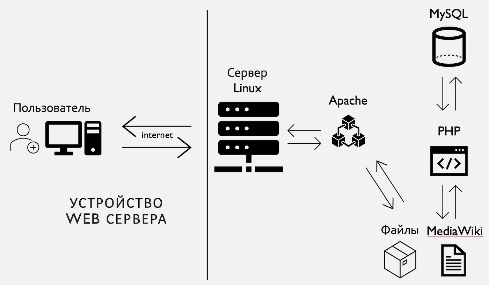
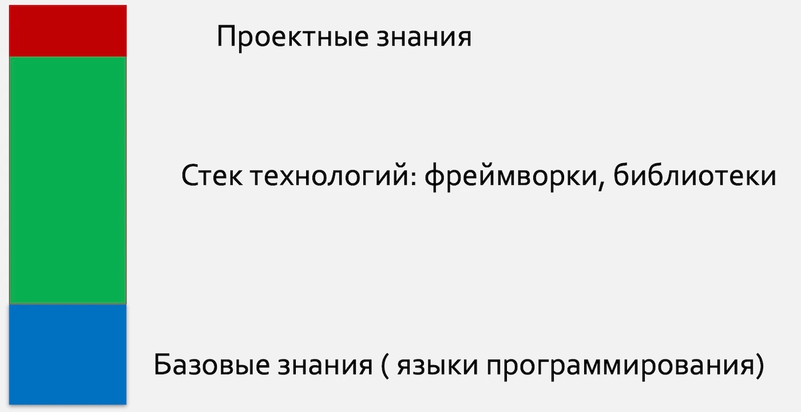
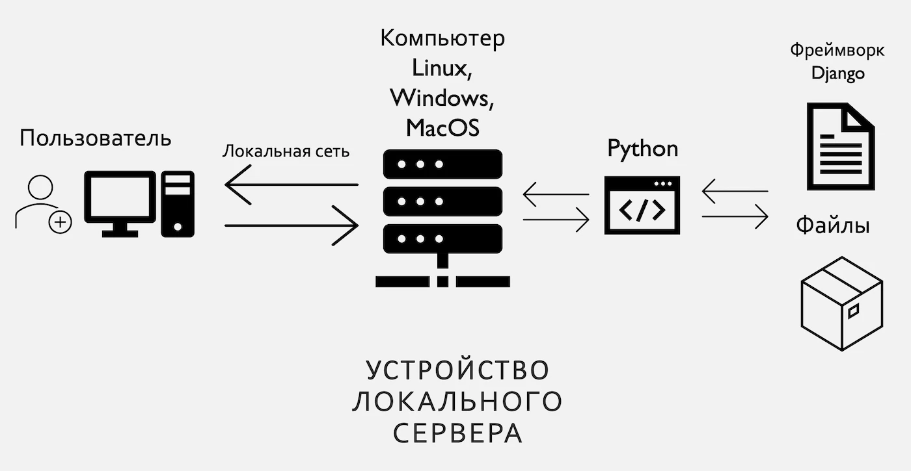
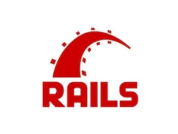

---
title: "Обзор фреймворков для создание Банка данных фольклорно-этнографических записей"
date: 2026-04-12T19:21:34+03:00
draft: false

author: "Кирилл В. Чеботарёв"
tags: ["фреймворк", "каталогизация", "база данных",  "Django", "Rails", "Laravel"]
categories: ["Автоматизация"]

description: ""
canonicalURL: ""

showToc: true
TocOpen: false
hidemeta: false
comments: false

disableHLJS: false
disableShare: false
hideSummary: false
searchHidden: false

ShowReadingTime: true
ShowBreadCrumbs: true
ShowPostNavLinks: true
ShowWordCount: true
ShowRssButtonInSectionTermList: true
UseHugoToc: true

cover:
  image: "cover.webp"
  alt: ""
  caption: ""
  relative: true
  hidden: false
---

<!-- Текст статьи начинается здесь.
Картинки можно просто перетаскивать в эту папку. -->
## Задача

Необходим инструмент для систематизации и работы с записями полученными в ходе экспедиций. Что для этого можно использовать? Простые таблицы _Exel_, может какие-то готовые программы можно приспособить под эти нужды или стоит написать свою программу? Что это будет за программа? Её устройство?  
Есть кажущаяся простота решения проблемы — найти программиста, заплатить за работу и он все сделает. Но на практике всё оказывается сложнее. Программисты не понимают специфики работы с фольклорным материалом, фольклористы не знают технологий и все это выливается в перерасход средств и не удовлетворительный результат.
<!--more-->
## Требования

Для начала важно понять какие требования мы предъявляем к программе которой мы будем пользоваться.

- Оперативный доступ к материалу и его описанию.
- Совместный доступ
- Делегирование различных прав доступа пользователям
- Доступ не требующий установки дополнительного программного обеспечения
- Независимость от разработчика
- Простота в установке и переносе на другой компьютер
- Независимость от типа операционной системы компьютера

Немного по пунктам.
Оперативный доступ — в идеале это доступ с любого компьютера в организации, возможно даже из дома и с мобильного телефона.
Совместный доступ — возможность работы одновременно всем сотрудникам. Не нужно идти к одному ответственному сотруднику и загружать его рутинными задачами по поиску нужной записи.
Делегирование прав — возможность ограничивать доступ на редактирование записей, на какие-то разделы.
Доступ не требующий установки программ — идеальное решение, это доступ через браузер. Раз уж у нас есть необходимость совместной работы которое обуславливает структуру сервер — клиент, вполне логично, что клиентом будет выступать браузер (Chrome, Firefox, Edge ).

> *Если изучить сборник [Мультимедийные и цифровые технологии в собирании, сохранении и изучении фольклора](https://books.google.ru/books?id=EsvpDwAAQBAJ) по результатам одноименной конференции,* 
> *то можно отметить, что большинство решений используемых для построения* 
> *таких систем сделаны при помощи WEB технологий*

## Готовые решения

Из наиболее популярных CMS (системы управления содержимым сайта) можно выделить такие как: Wordpress, Drupal, Joomla, MediaWiki

Первые три — Wordpress, Drupal, Joomla являются блоговыми или новостными движками ориентированными на решение таких задач как новостной блог, сайт организации, интернет магазин и так далее. Страницы которые создаются в интерфейсе администратора ориентированы на размещение статей, вывод страниц на сайте по умолчанию в виде новостной ленты с заголовком и тизером, порядок вывода по дате добавления.
Для возможности формирования своей структуры, логики и типов статей необходимо искать и устанавливать расширения. Плюсом этих систем является низкий порог вхождения для редактора. Минусом — необходимость устанавливать и настраивать расширения.

MediaWiki — совершенно отличная от этих трех система. Это свободно распространяемый движок на котором работает известный сайт Wikipedia. Он очень хорошо подходит для публикации материалов энциклопедического характера, позволяет выстраивать сложные семантические связи и организовывать данные в различного уровня сложности структуру. Плюсом системы можно отметить то, что идеально подходит для построения на ней системы учета фольклорно-этнографических материалов. Минусом — сложность освоения для редактора. Все материалы оформляются при помощи специальной разметки markdown, структура и ссылки так же требует оформления через специальный синтаксис. Для более удобной работы так же требуется поиск и установка расширений.

Общим минусом у всех готовых решения является необходимость их установки на выделенный сервер.
В случае если эти системы устанавливаются автоматически на сервере платного хостинга, то мы получаем ограничение в виде дороговизны дискового пространства. В нашем случае это очень важный показатель, так как аудио, видео и фото даже при сжатии занимают много места.

> *Здесь я хотел бы отметить важный момент. Говоря вообще о создании такой системы я подразумеваю, что материалы в систему будут вноситься в сжатом формате. Аудио — mp3 или ogg, у видео будет снижен битрейт и сжат кодеком h264 (mp4), изображения будут конвертированы в JPEG с разрешением  оптимальным для полноэкранного просмотра. Опыт работы с архивом показывает, что объем при этом можно уменьшить на 60%-70% без сильно видимых и слышимых  потерь в качестве.*

В случае же если мы ставим систем на свой личный сервер, то мы упираемся в сложность настройки и администрирования самого сервера.

Схема приведена не для того, чтобы разобраться в устройстве. Здесь я хочу обратить внимание, что для запуска CMS придется настроить минимум три серверные программы (Apache, PHP, MySQL), при этом все это необходимо настраивать в операционной системе Linux. Справедливости ради надо отметить, что все это можно сделать и на Windows, но надежность такой установки авторы всех этих программ не гарантируют. Версии под Windows служат в основном для разработки.
Всё это вкупе с минусами готовых решений подвигает нас к созданию какого-то своего более удобного решения.
Фреймворки

На  Википедии слово фреймворк объясняется как каркас для создания программного продукта. Мне больше нравится в этом смысле аналогия с полуфабрикатом. Фреймворк, это полуфабрикат для программиста. Очень важно, что на полуфабрикате так же указан точный рецепт приготовления блюда.
Фреймворки, это написанный заранее каркас программы где программист в процессе разработки своего приложения пишет код по уже заданным правилам. Свобода в создании продукта остается, поскольку в его ведении остаются типы страниц, внутренняя логика и структура. В фреймворке уже решены все типовые задачи — авторизация, полномочия, построение зависимостей между компонентами и так далее. Все это дает в первую очередь независимость заказчика от программиста и скорость разработки, поскольку базовая часть уже написана заранее.

В ситуации когда код программы написан с нуля одним программистом найти замену или кого-то кто смог бы доработать, обновить или в некоторых случаях даже перенести на новый сервер очень проблематично. Разобраться в чужом коде для нового человека будет крайне непросто. Это называется проектные знания. Для того, чтобы снизить порог вхождения программиста в новый проект и были придуманы фреймворки. Код написан по строго определенным правилам, программист приходит в проект уже зная необходимый базис (базовые знания и стек технологий), время на изучения специфики проекта уменьшается. Как компромисс возможно рассматривать готовые решения как базовую часть кода и дописывать необходимый функционал. Такое решение используется в  [Научном центре народной музыки им. К. В. Квитки МГК](https://www.mosconsv.ru/ru/groups.aspx?id=120430) на базе **CMS Joomla**.

Следующим плюсом использования web фреймворков в контексте создания системы учета для фольклорно-этнографических материалов является тот факт, что многие из популярных фреймворков уже имеют встроенную программу-сервер разработки.

Сервер разработки, это встроенная команда в фреймворке, которая позволяет запустить проект и проверить его со стороны пользователя без необходимости настройки всего пула программного обеспечения как на реальном сервере. Сервер разработки не рекомендован для публикации его в сети интернет. Но в действительности он способен обеспечить стабильность и надежность его использования для одновременного пользования 10-30 человек. Возможно и больше, но для наших задач, это вполне достаточно, учитывая тот факт, что программу всегда при необходимости можно перенести на боевой сервер. Все дело в том, что вышеописанный набор программ необходимый для запуска приложения на сервере Linux предназначен именно для того, чтобы сайт мог справляться с нагрузкой более 1000 запросов в секунду.
Если уж проект вырастет до такой степени, что ему потребуется справляться с подобным наплывом посетителей, то ничего не мешает запустить все это на реальном сервере по вышеозначенной схеме.
Обзор

В обзоре я постарался показать самые популярные бесплатные фреймворки.
Все они независимы от типа операционной системы, все они легко запускаются при помощи единственной команды и все они могут быть перенесены с одного компьютера на другой путем простого копирования. Обязательным условием для них всех, это наличие на компьютере предварительно установленного интерпретатора того языка на котором они написаны. Установка эта ничем не отличается от установки любой программы вроде Google Chrome или Skype. Так же возможно в процессе разработки надо будет поставить задачу программисту написать скрипт настройки рабочего окружения для первого старта. В действительности это еще две — три команды которые запускаются один раз перед первым запуском. Я подчеркиваю тот факт, что это требуется именно для переноса серверной части программы. Клиенту работающему с ней через браузер ничего настраивать не нужно.

Почему имеет смысл выбирать популярные решения, а не те, которые удобны разработчику? Возможно вашему знакомому или предложившему хорошую цену, но с условием что выбор фреймворка за ним?
Популярность является некоторым гарантом того, что :

- они дольше будут актуальны
- у них чаще выходят обновления
- в них быстрее находятся и устраняются уязвимости
- у них больше расширений написанных сообществом
- для разработки проще найти программиста
- проще при случае разобраться самому, так как больше обучающих материалов с сети

## ТОП три web фреймворка на 2021 год

1) [Laravel](https://laravel.com/) написанны на языке PHP 
   

PHP самый распространенный язык для сайтов в интернете. Все готовые решения приведенные выше написаны именно на нем. В PHP встроенный сервер разработки появился недавно, он достаточно прост, но вполне надежен. Laravel не может похвастаться тем, что его используют какие-либо крупные компании, но количество проектов на нем доказывает, что это очень хорошее решение для небольших и средних проектов. Так же плюсом можно выделить то, что большинство на большинстве хостингов PHP утсановлен по умолчанию даже на самых дешевых тарифах.

2) [Rails](https://rubyonrails.org/) написанный на языке Ruby 
   

Пик популярности фреймворка пришелся на 2013 — 2015 годы, первый выпуск — 2004 год. Rails используется в таких крупных компаниях как Airbnb, Twitch, GitHub, Spotify, SoundCloud. Движок очень удобен для разработки, прост в освоении. Минус — малое количество хостингов с поддержкой Ruby.

3)[ Django](https://www.djangoproject.com/) написанный на Python 

Очень популярный фреймворк, в подавляющем большинстве курсов по изучению языка Python используется в программе обучения, несмотря на то, что на Python есть и другие популярные фреймворки. Django используется в Instagram, Mozilla, National Geographic, Pintertest, Youtube. Еще одним из косвенных преимуществ Django является то, что язык Python активно используется в работе с нейронными сетями, что на мой взгляд является будущим в сфере обработки и анализа фольклорно-этнографических материалов.
Минус — малое количество хостингов с поддержкой Python.

> *Последние пункты (плюсы и минусы) относительны, поскольку при запуске такого рода проектов в сеть стандартный хостинг уже не подойдет и необходимо будет арендовать выделенный сервер, где все настраивается вручную.*

## Итоги

Помимо приведенных выше, конечно есть еще много популярных других. Например обязательно стоит упомянуть связку **Node.js + Express** написанную на Java. Достаточно сказать, что именно на Node.js работает платежная система PayPal. Для Python стоит упомянуть такие фреймворки как **Flask** и **FastAPI**, для PHP — **Symphony** и **YII2**. Многие программисты отдают им предпочтение и часто это обусловлено в том числе и необходимостью иметь больше свободы для написания кода и интеграции с какими-нибудь другими системами. Но поскольку мы рассматривали эти продукты именно с точки зрения создания удобной и дешевой системы для  фольклорно-этнографических материалов, то здесь мне кажется — чем проще, тем лучше. Чем популярней, тем надежней.